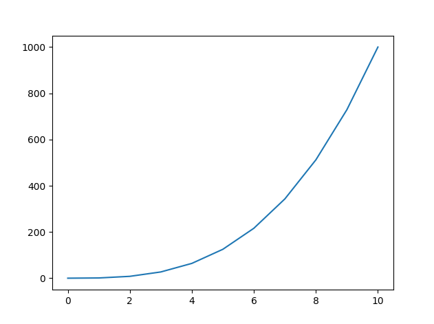
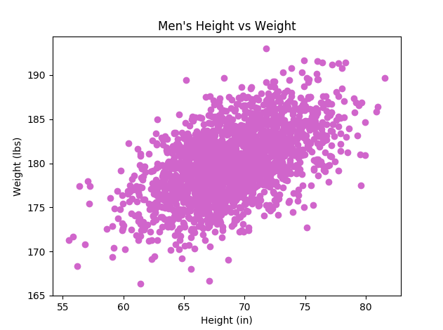
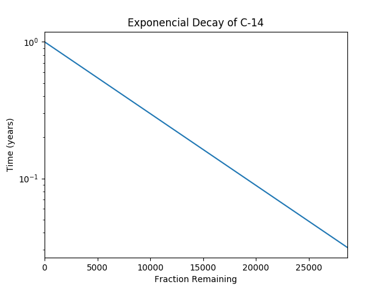
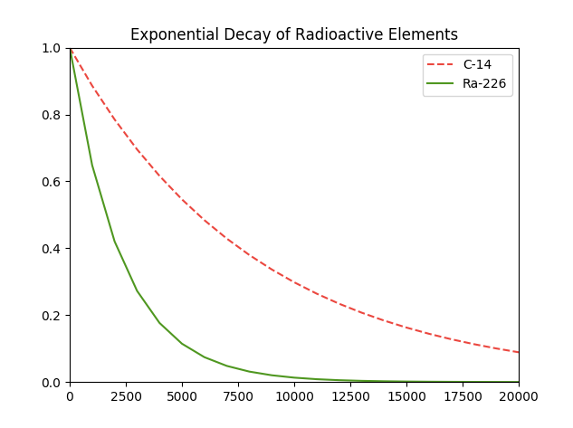
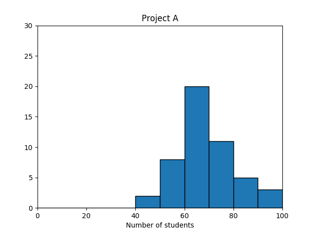
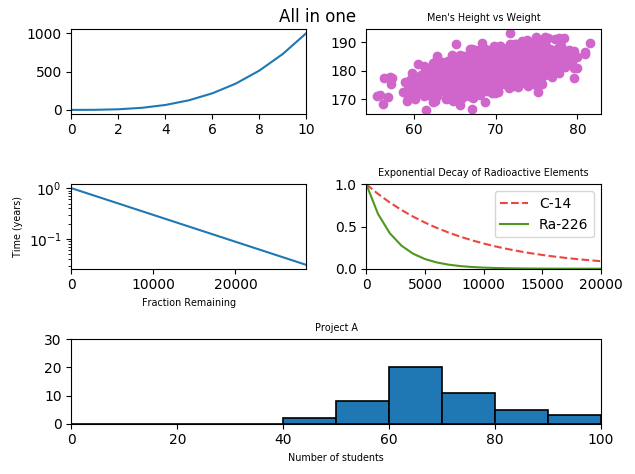

# 0x01.Plotting

### Learning Objectives
At the end of this project, you are expected to be able to explain to anyone, without the help of Google:

#### General
- What is a plot?
- What is a scatter plot? line graph? bar graph? histogram?
- What is matplotlib?
- How to plot data with matplotlib
- How to label a plot
- How to scale an axis
- How to plot multiple sets of data at the same time

## 0. Line Graph

## 1. Scatter

## 2. Change of scale

## 3. Two is better than one

## 4. Frequency

# 5. All in one

